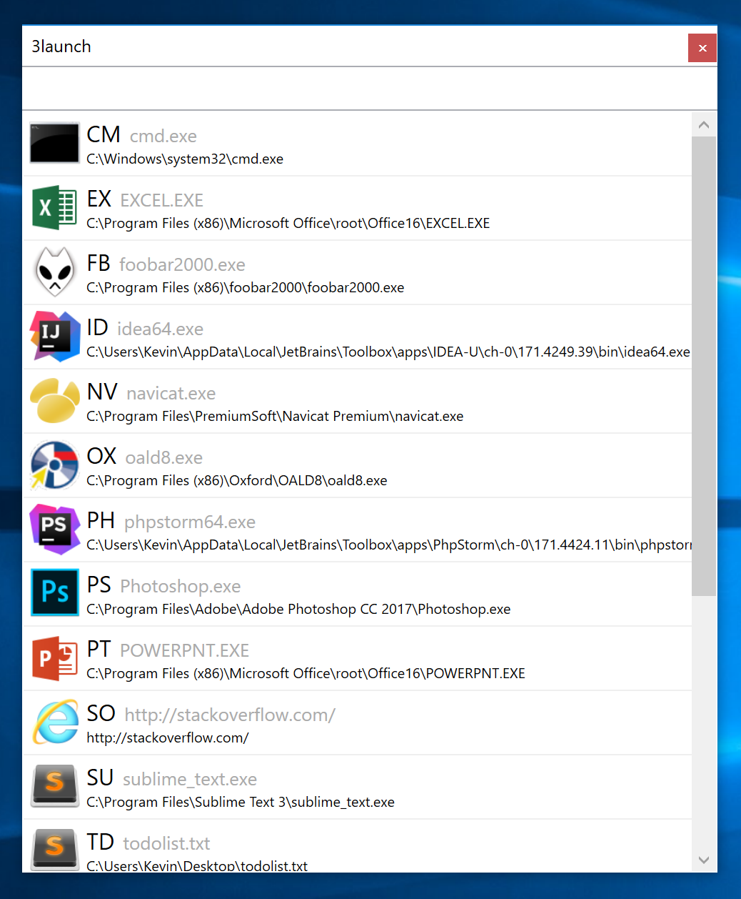

# 3launch
Launch your favorite programs with only 3 keystrokes! (hence the name)

```3launch``` is an ultra-fast customizable program launcher.

For example (It's fully configurable!):

* <kbd>Win</kbd>+<kbd>V</kbd>+<kbd>S</kbd> = Visual Studio
* <kbd>Win</kbd>+<kbd>P</kbd>+<kbd>S</kbd> = Photoshop
* <kbd>Win</kbd>+<kbd>S</kbd>+<kbd>O</kbd> = Open StackOverflow.com

Just press <kbd>Win</kbd>, then another 2 keystrokes, and the program is launched.

# Screenshot


# How to use

1. Put your shortcuts (.lnk files) in ./shortcuts/
   They MUST be named [TWO ENGLISH CHARACTERS].lnk (e.g. ps.lnk) in order to work
2. Run ./3launch.exe
3. Press Windows key to call 3launch, press another 2 keys to launch your program!

## Tips:

1. You can press Windows key again or press Esc to hide 3launch
2. You can also click on a list item instead of pressing 2 keys to launch a program
3. When the contents of ./shortcuts/ is changed, 3launch will update automatically

# How to configure to start on boot / stop application

Run ./Configurator.exe

# How to call the original Windows menu

Either stop this application or use Ctrl + Esc

# Type of files supported

1. Generic files (using default launcher for specific extension)
2. Directories
3. .exe
4. .url
5. .bat

# Report issues / Contribute code

https://github.com/KevinWang15/3launch

# License

MIT License
Copyright (c) 2017 Kevin Wang
